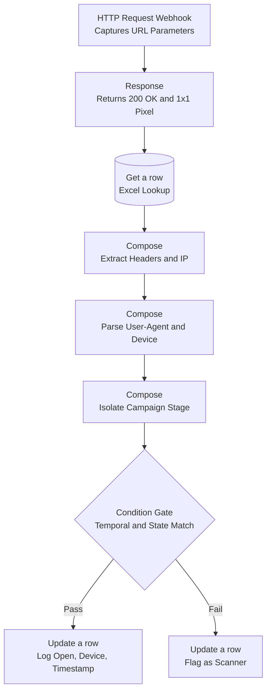

# Flow 1 — Open Tracking (Listener Architecture)

A transparent 1×1 pixel embedded in outbound email. When the image loads, it calls a Power Automate HTTP webhook carrying the lead ID and campaign stage. The flow returns the image immediately, then runs its checks in the background and writes the result to the ledger.

---

## Flow

---

## Steps

**1. Trigger and immediate response**
The HTTP Request trigger listens for the pixel load and captures URL parameters — the lead ID and the campaign stage, e.g. `&step=INITIAL`.

The Response action fires **before** any processing. It returns `200 OK` and the transparent image straight away. If it ran at the end, the recipient's mail client would hang waiting for the image while the rest of the flow executed, and might render a broken-image icon. Everything after the response is background work as far as the recipient is concerned.

**2. Lookup and extraction**
`Get a row` pulls the lead's record using the captured ID, retrieving the send timestamp and current stage.

Compose blocks extract the HTTP headers — `x-forwarded-for` for IP, and `User-Agent` — and parse the latter to classify the device as desktop, mobile, or unknown.

**3. The condition gate**
Every request is treated as automated until it passes three checks:

1. More than 60 seconds elapsed since the send timestamp
2. The stage in the URL matches the lead's current stage in the ledger
3. The `User-Agent` is not a recognisable headless client

**Pass:** open count incremented, status set to verified, device and timestamp logged.
**Fail:** row flagged as a scanner hit, engagement status left unchanged.

---

## Limitations

**Apple Mail Privacy Protection defeats this entirely.** MPP pre-fetches every image in every message through Apple's proxy, whether or not the recipient opens it. The fetch is not instantaneous, so the 60-second check passes. The User-Agent looks like an ordinary client, so the header check passes. Gmail's image proxy behaves similarly. For any recipient base with meaningful Apple Mail usage, a share of the verified opens are the proxy rather than a human, and this flow cannot distinguish them.

**The 60-second threshold is a guess.** It is a plausible number, not one derived from observing actual scanner timing. A patient scanner defeats it; a genuinely fast reader on a mobile notification could be caught by it.

**IP is captured but not used.** `x-forwarded-for` is extracted and logged, but nothing checks it against known scanner ranges or geolocation. That would be the next filter worth adding.

**Forwarded email attributes to the original recipient.** The lead ID is baked into the pixel URL. If the email is forwarded, opens from the new reader are logged against the original prospect.

**No deduplication of repeat opens.** The counter increments each time. Deliberate — repeat opens are a signal — but it means a single message left open in a preview pane can inflate the number.

**Never tested at volume.** Built in my final weeks in the role. I have no data on how the HTTP trigger behaves under concurrent load or what the practical throughput ceiling is.
