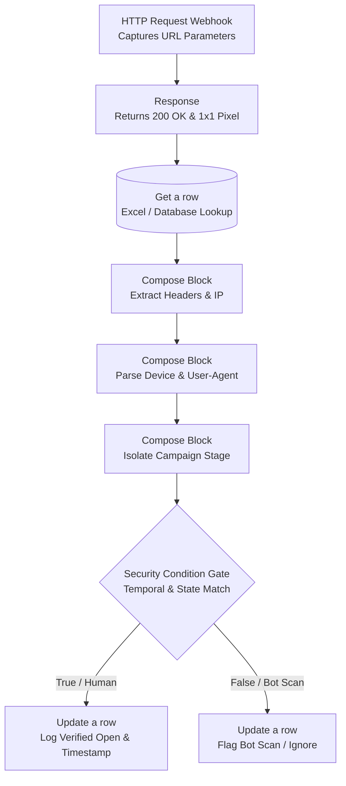

# Flow 1: The Listener Architecture (Open Tracking)

## System Overview
The Listener Flow is a custom webhook built to track genuine human email opens without relying on third-party marketing plugins. By injecting a transparent 1x1 pixel into standard outbound emails, this flow acts as an invisible bridge between the recipient's inbox and the central database. 

It is engineered with strict defensive logic to filter out corporate firewall scanners, pre-fetch bots, and preview panes, ensuring that only zero-false-positive human engagement is logged.

## Architectural Diagram

## Step-by-Step Execution

### 1. The Trigger & Connection
*   **Manual (HTTP Request):** Acts as a webhook listening for a "ping" when the 1x1 pixel is loaded. Captures unique URL parameters, including the lead's ID and the email stage (e.g., `&step=INITIAL`).
*   **Response:** Instantly returns a "200 OK" status code and the actual transparent image to the server. Firing this immediately prevents the recipient's email client from hanging or showing a broken image icon while the rest of the flow processes in the background.

### 2. Data Retrieval & Extraction
*   **Get a row:** Uses the captured ID to look up the exact lead in the database, pulling their current `SentDate` and `LeadStage` to prepare for logic checks.
*   **Compose Blocks:** Extracts technical HTTP headers, specifically targeting the IP address (`x-forwarded-for`) and browser information (`User-Agent`). It parses the User-Agent string to determine if the email was opened on Desktop, Mobile, or an Unknown device.

### 3. The Routing Engine (Bot Defense)
Instead of assuming every ping is a human reading the email, the flow treats every request as a bot until proven otherwise using a strict condition gate.
*   **Condition Rules:** 
    1. Has it been more than 60 seconds since the `SentDate`?
    2. Is the URL stage an exact match for the database `LeadStage`?
    3. Does the User-Agent prove it is not a headless bot or a preview pane?
*   **True Branch (Verified):** If all conditions pass, it is a verified human. The flow updates the database by adding +1 to the open count, marking the Status as "Verified", logging the device type, and recording the exact time.
*   **False Branch (Bot Scan):** If a single condition fails, it is flagged as automated noise. The flow flags the row as a "Bot Scan" but leaves the engagement step as "Not Opened Yet."

## Campaign Impact & GTM Value

*   **Zero False Positives:** Eliminates the "fake opens" that heavily skew standard email marketing platforms. A "Verified" status guarantees actual screen time from a prospect.
*   **Pristine Analytics:** By categorizing opens into "Verified" vs. "Bot Scan," open rate percentages reflect genuine human interest, allowing for highly accurate A/B testing of subject lines and copy.
*   **Targeted Sales Follow-ups:** Sales resources are optimized. Reps know exactly who is engaging, on what device, and at what stage of the sequence, completely eliminating calls to leads who never saw the message.
