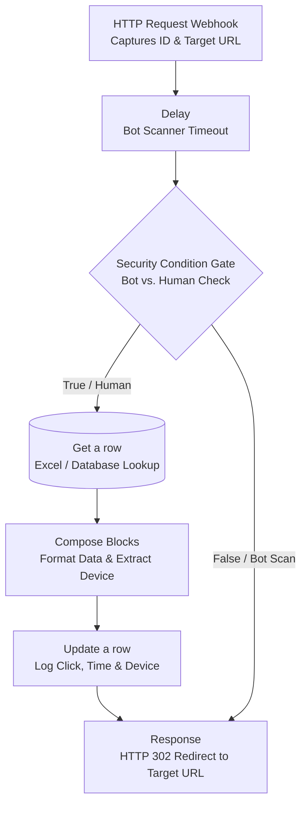

# Flow 2: The Click and Device Architecture (Link Tracking)

## System Overview
The Click and Device flow is a "Man-in-the-Middle" tracking system built to intercept, analyze, and log link clicks before seamlessly redirecting the user to their final destination. 

Instead of linking directly to a landing page, outgoing emails route through this lightweight Power Automate webhook. It acts as a momentary checkpoint that filters out automated corporate security scanners, logs high-intent human engagement (including device context), and instantly issues an HTTP 302 redirect so the user experiences zero latency.

## Architectural Diagram

## Step-by-Step Execution

### 1. The Interception & Timeout
*   **Manual (HTTP Request):** Outbound emails contain a link to this flow's webhook rather than the direct website URL. When clicked, this trigger catches the lead's unique ID and their intended destination URL as parameters.
*   **Delay:** A strategic 1-2 second pause is injected immediately. Automated corporate security bots often "pre-fetch" links the millisecond an email arrives. This slight delay causes impatient bot scanners to timeout, acting as a frontline defense against false click metrics.

### 2. The Filter Engine (Security Gate)
*   **Condition:** The flow evaluates the incoming request headers (such as `User-Agent` and IP address) to determine if the click originated from a genuine browser or an automated server.
*   **False Branch (Bot Scan):** If the click is determined to be a bot, the flow bypasses the database completely, ensuring fake clicks are ignored and metrics remain pristine.

### 3. The Logging Process (True Branch)
If the security condition passes, the flow executes the logging sequence:
*   **Get a row:** Reaches into the central database to locate the specific lead using the captured ID.
*   **Compose Blocks:** Extracts and formats the `User-Agent` string to determine if the lead is browsing on a Desktop or Mobile device, and formats the current timestamp.
*   **Update a row:** Writes the data back to the database, switching the "Clicked" status to "Yes", logging the specific device type, and recording the exact click time.

### 4. The Redirection
*   **Response (HTTP 302):** Crucially placed outside of the condition branches, this final step executes for both humans and bots. It instantly issues an HTTP 302 Redirect, forwarding the user directly to the actual webpage they intended to visit. Because this entire process executes in milliseconds, the routing is completely invisible to the end user.

## Campaign Impact & GTM Value

*   **High-Intent Data Capture:** While open rates indicate surface-level attention, accurately tracked click rates signal active interest. This system guarantees that every logged click represents a genuine prospect interacting with the material.
*   **Cleaner Metrics:** By actively filtering out firewall tests and security sandboxes, total click metrics are not artificially inflated, providing a reliable foundation for revenue operations and pipeline forecasting.
*   **Device Context:** By capturing Desktop vs. Mobile usage, future campaigns and landing pages can be strategically optimized for the exact platforms the target audience is actually using.
