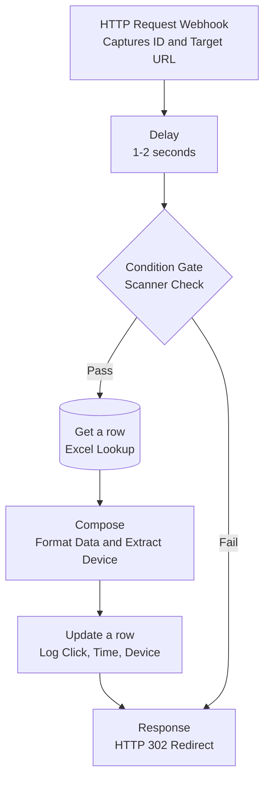

# Flow 2 — Click Tracking (Redirect Architecture)

Links in outbound email point at a Power Automate webhook rather than the destination. The flow intercepts the click, filters obvious scanner traffic, logs verified clicks with device context, and issues an HTTP 302 redirect to the real URL.

---

## Flow

---

## Steps

**1. Interception and delay**
The webhook captures the lead ID and the intended destination URL as parameters.

A 1–2 second delay runs immediately. The reasoning is that corporate scanners pre-fetch links within milliseconds of delivery and many will time out rather than wait. It is a crude filter, and it has a cost — see limitations.

**2. Condition gate**
Evaluates request headers — `User-Agent`, IP — to judge whether the click came from a browser or an automated client.

**Fail:** skips the database entirely. The click is not logged.

**3. Logging**
On pass: `Get a row` locates the lead, Compose blocks parse the User-Agent for device type and format the timestamp, `Update a row` writes the click status, device, and time back to the ledger.

**4. Redirect**
The Response action sits **outside** both branches, so it runs for humans and scanners alike. It issues an HTTP 302 to the captured destination. A scanner that gets filtered still reaches the target — it just does not get counted.

---

## Why the response is outside the branches

If the redirect only fired on the human path, anything the filter rejected would hit a dead end. That would be visible to a real person misclassified as a bot, and it would also make the filter's behaviour obvious to anyone probing it. Redirecting everyone and logging selectively separates the routing concern from the analytics concern.

---

## Limitations

**Open-redirect vulnerability.** The destination URL is taken from a request parameter and forwarded to without validation. Anyone who obtains the webhook URL can construct a link that redirects to any destination they choose. That is a real security issue — it is the standard pattern for phishing links that appear to originate from a trusted domain. The fix is an allowlist of permitted destination domains, checked before the 302 is issued. This is the first thing I would change.

**The delay is perceptible.** One to two seconds between click and page load is noticeable to a human. For cold outreach, where the value is clean data, I would accept it. For a nurture sequence to warm leads I would remove the delay and take dirtier metrics rather than add friction to someone already engaged.

**Delay-based filtering is easily defeated.** Any scanner that waits will pass. It catches the impatient ones, which is some of them, not most of them.

**No deduplication.** The same person clicking twice logs twice. Whether that is right depends on what you are measuring.

**Forwarded links attribute to the original recipient.** The lead ID travels with the URL, so a forwarded link logs clicks against the original prospect.

**Header-based bot detection is heuristic.** User-Agent strings are trivially spoofable. This catches default scanner signatures, not anything deliberately disguised.

**Never tested at volume.** Built in my final weeks in the role, so I have no data on latency under concurrent load — which matters more here than for open tracking, since a human is waiting on the response.
